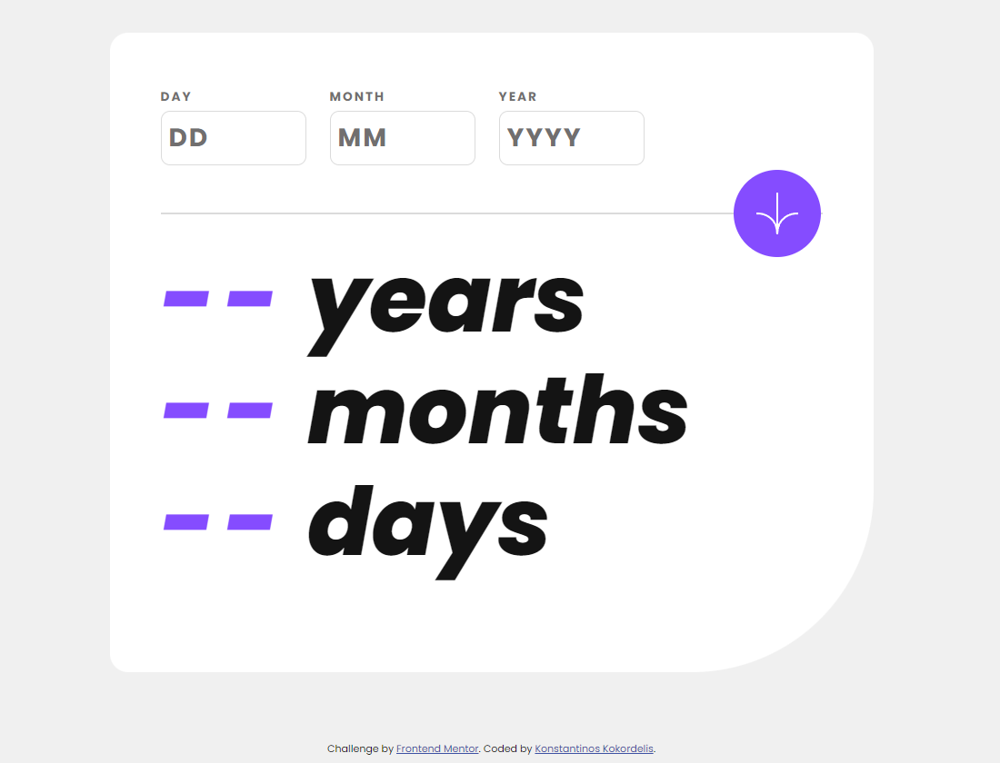
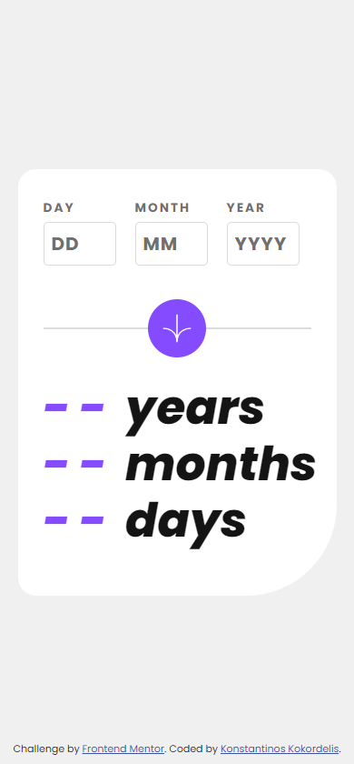

# Frontend Mentor - Age calculator app solution

This is a solution to the [Age calculator app challenge on Frontend Mentor](https://www.frontendmentor.io/challenges/age-calculator-app-dF9DFFpj-Q). Frontend Mentor challenges help you improve your coding skills by building realistic projects. 

## Table of contents

- [The challenge](#the-challenge)
- [Screenshots](#screenshots)
- [Links](#links)
- [Built with](#built-with)
- [Installation](#installation)
- [Usage](#usage)
- [Author](#author)

**Note: Delete this note and update the table of contents based on what sections you keep.**

## The challenge

Users should be able to:

- View an age in years, months, and days after submitting a valid date through the form
- Receive validation errors if:
  - Any field is empty when the form is submitted
  - The day number is not between 1-31
  - The month number is not between 1-12
  - The year is in the future
  - The date is invalid e.g. 31/04/1991 (there are 30 days in April)
- View the optimal layout for the interface depending on their device's screen size
- See hover and focus states for all interactive elements on the page
- **Bonus**: See the age numbers animate to their final number when the form is submitted

## Screenshots





## Links

- Solution URL: [https://github.com/felagund1789/age-calculator-app](https://github.com/felagund1789/age-calculator-app)
- Live Site URL: [https://age-calculator-app-lyart-beta.vercel.app/](https://age-calculator-app-lyart-beta.vercel.app/)

## Built with

-  Semantic HTML5 markup 
-  CSS custom properties
-  Flexbox
-  Mobile-first workflow
- 
- 

## Installation

To get started with this project, you need to clone the repository and install the necessary dependencies.

### Clone the Repository

```bash
git clone https://github.com/felagund1789/login-form.git
cd login-form
```

### Install Dependencies
```bash
npm install
```
## Usage

To run the project locally:

```bash
npm run dev
```

This will start a development server using Vite. Open your browser and navigate to `http://localhost:5173` to view the application.

## Author

- Website - [@felagund1789](https://github.com/felagund1789)
- Frontend Mentor - [@felagund1789](https://www.frontendmentor.io/profile/felagund1789)
